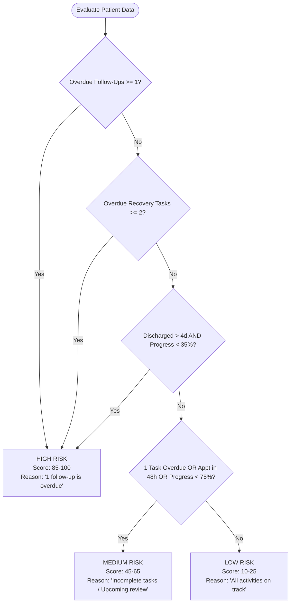

# CareTransition — Patient Discharge & Follow-Up Tracker

> **A specialized, interview-ready healthcare SaaS frontend built with Angular 19, TypeScript, Standalone Components, Reactive Forms, Angular Signals, and a Rule-Based Follow-Up Risk Engine.**


---

## 1. Project Overview

**CareTransition** is a modern post-acute clinical coordination platform. Unlike generic Hospital Management Systems (HMS) that focus on hospital billing, inventory, or room scheduling, CareTransition focuses exclusively on the critical 30-day window **after a patient is discharged from a hospital**.

In clinical practice, a significant percentage of post-surgical complications and preventable 30-day readmissions occur due to missed OPD follow-up visits, medication misunderstandings, and unmonitored recovery tasks. CareTransition empowers care coordinators and hospital discharge teams with real-time tracking, proactive overdue alerts, and transparent rule-based risk stratification.

---

## 2. Core Value Proposition

CareTransition helps clinical care teams answer 7 critical questions at a glance:
1. **Which patients were recently discharged?**
2. **Which OPD follow-ups are scheduled for today?**
3. **Which follow-ups are upcoming across departments?**
4. **Which follow-up visits are currently overdue?**
5. **Which recovery tasks and vitals checks are incomplete?**
6. **Which patients require immediate clinical attention?**
7. **What is the patient's recovery adherence percentage?**

---

## 3. Key Features

- **Clinical Intelligence Dashboard**:
  - Hero section highlighting the 5-stage patient transition journey with subtle floating parallax accents (`prefers-reduced-motion` compliant).
  - 6 Key Performance Metric cards (Active Patients, 7-Day Discharges, Today's Follow-Ups, Upcoming Reviews, Overdue Alerts, Global Adherence Rate).
  - Prioritized list of *"Patients Requiring Immediate Attention"* with actionable risk reasons.
  - Quick-action calendar widgets for today's and upcoming follow-ups with 1-click completion.
  - Cohort risk distribution analytics (High, Medium, Low).
- **Patient Directory (`/patients`)**:
  - Search by patient name, primary diagnosis, attending doctor, department, or contact number.
  - Filter by Risk Level (High / Medium / Low) and Care Status (Active / Attention Needed / Completed).
  - Sort by discharge date, risk severity score, or patient name.
  - Hybrid Grid View and Data Table View toggling.
  - Reactive form registration and inline profile editing with full validation.
- **Centerpiece Patient Details (`/patients/:id`)**:
  - Clinical Header with demographics, Indian contact numbers, caregiver details, attending physician, and prominent **Rule-Based Risk Panel**.
  - Visual 5-Step **Patient Recovery Stepper** (*Discharged $\rightarrow$ Medication Regimen $\rightarrow$ Clinical Follow-Up $\rightarrow$ Recovery Milestones $\rightarrow$ Care Clearance*).
  - Tab 1: **Discharge Plan & Red Flags** (Summary, wound care guidelines, dietary/activity protocols, emergency red flag symptoms checklist).
  - Tab 2: **Medication Regimen** (Dosage, frequency, duration dates, active/completed status toggling, CRUD modals).
  - Tab 3: **Follow-Up Appointments Timeline** (Visual timeline, overdue warning banners, 1-click "Mark as Attended" action, scheduling modals).
  - Tab 4: **Recovery Tasks Checklist** (Categorized interactive checklist with live progress recalculation and status badges).
- **Follow-Up Appointment Center (`/follow-ups`)**:
  - Global cross-patient appointment tracking with tabs: *All, Overdue, Today, Upcoming, Completed*.
  - Fast status toggling, editing, rescheduling, and deletion.
- **Recovery Task Regimens (`/recovery-tasks`)**:
  - Category filters (*Physical Therapy, Vitals, Wound Care, Diet, Medication, General Care*).
  - Interactive adherence checklist with instant progress updates.
- **Medication Adherence (`/medications`)**:
  - Global prescription adherence tracker with active vs. completed status filters.
- **Rule-Based Follow-Up Risk Indicator**:
  - Pure, transparent algorithmic risk calculation (no black-box or pseudo-AI).

---

## 4. Rule-Based Follow-Up Risk Engine

The risk engine is encapsulated inside `RiskAssessmentService` and follows transparent clinical rules:



### Risk Stratification Tiers:
| Risk Tier | Conditions | Example Status Reason |
| :--- | :--- | :--- |
| **HIGH RISK** | • $\ge 1$ overdue follow-up appointment<br>• $\ge 2$ overdue recovery tasks<br>• Recovery completion $< 35\%$ after $> 4$ days post-discharge | *"1 follow-up appointment is overdue."*<br>*"2 recovery tasks are overdue."* |
| **MEDIUM RISK** | • Follow-up appointment scheduled within next 48 hours<br>• 1 overdue recovery task<br>• Active tasks incomplete with $< 75\%$ completion | *"1 recovery task is overdue."*<br>*"Upcoming clinical follow-up pending within 48 hours."* |
| **LOW RISK** | • 0 overdue appointments & 0 overdue tasks<br>• Recovery checklist completion $\ge 75\%$ | *"All scheduled follow-ups and recovery activities are on track."* |

---

## 5. Clinical Demo Cohort (Indian Context)

The application is pre-seeded with 6 realistic fictional patient scenarios tailored to Indian clinical and demographic contexts:

1. **Ramesh Kulkarni** (Age 68, Male) — `pat-101`
   - **Primary Diagnosis**: Total Knee Replacement (Right TKR)
   - **Attending Doctor**: Dr. Arvind Swaminathan (Orthopedics OPD)
   - **Contact**: `+91 98230 45678` | **Emergency**: `+91 98230 99887 (Son - Amit Kulkarni)`
   - **Risk Level**: **HIGH RISK** (Missed 1-week OPD suture check and right knee ROM assessment)
   - **Medications**: *Clexane 40mg injection, Ultracet, Pantocid 40*
   - **Instructions**: High-protein diet (paneer, dalia, pulses); strict avoidance of squatting or Indian-style toilets.

2. **Sunita Sharma** (Age 56, Female) — `pat-102`
   - **Primary Diagnosis**: Post-CABG (Coronary Artery Bypass x 3)
   - **Attending Doctor**: Dr. Sanjay Verma (Cardiology & CTVS OPD)
   - **Contact**: `+91 98112 34567` | **Emergency**: `+91 98112 88776 (Husband - Suresh Sharma)`
   - **Risk Level**: **HIGH RISK** (1 Overdue follow-up ECG & Sternal check, 2 incomplete vitals logs)
   - **Medications**: *Betaloc 50, Atorva 40, Ecosprin 75*
   - **Instructions**: Low-salt (< 2g/day) heart diet. Avoid fried snacks, papads, pickles, and ghee.

3. **Pooja Iyer** (Age 42, Female) — `pat-103`
   - **Primary Diagnosis**: Laparoscopic Cholecystectomy
   - **Attending Doctor**: Dr. Rajeshwari Gupta (General Surgery)
   - **Contact**: `+91 98450 12345` | **Emergency**: `+91 98450 67890 (Husband - Karthik Iyer)`
   - **Risk Level**: **MEDIUM RISK** (Port review pending in 2 days)
   - **Medications**: *Dolo 650, Cremaffin Plus Syrup*
   - **Instructions**: Light low-fat Indian meals (khichdi, idli, dal soup). Avoid oily curries, samosas, and dairy fats for 2 weeks.

4. **Mohammad Farooqui** (Age 71, Male) — `pat-104`
   - **Primary Diagnosis**: Community-Acquired Bronchopneumonia
   - **Attending Doctor**: Dr. Farhan Kidwai (Pulmonology OPD)
   - **Contact**: `+91 98901 23456` | **Emergency**: `+91 98901 98765 (Son - Zeeshan Farooqui)`
   - **Risk Level**: **MEDIUM RISK** (Follow-up scheduled for today at 3:30 PM)
   - **Medications**: *Augmentin 625 Duo, Foracort 200 Inhaler*
   - **Instructions**: Spirometer 10 breaths every 2 hours, SpO2 charting, warm water & steam inhalation.

5. **Ananya Deshmukh** (Age 61, Female) — `pat-105`
   - **Primary Diagnosis**: Type-2 Diabetes with Diabetic Foot Ulcer
   - **Attending Doctor**: Dr. Vivek Murthy (Endocrinology & Diabetic Foot Care)
   - **Contact**: `+91 97654 32109` | **Emergency**: `+91 97654 88990 (Daughter - Sneha Deshmukh)`
   - **Risk Level**: **LOW RISK** (85% checklist adherence, follow-up in 4 days)
   - **Medications**: *Glycomet-GP 1, Neurobion Forte*
   - **Instructions**: Mirror foot inspection, glucometer log, custom diabetic footwear.

6. **Vikramaditya Sengupta** (Age 59, Male) — `pat-106`
   - **Primary Diagnosis**: Transient Ischemic Attack (TIA) Recovery
   - **Attending Doctor**: Dr. Debashish Roy (Neurology OPD)
   - **Contact**: `+91 98300 11223` | **Emergency**: `+91 98300 55443 (Wife - Aparna Sengupta)`
   - **Risk Level**: **LOW RISK / COMPLETED** (100% adherence, Doppler completed)
   - **Medications**: *Clopilet 75 (Clopidogrel)*

---

## 6. Technology Stack

- **Framework**: Angular 19 (Standalone Components, Signals, Computed Signals, Router, Reactive Forms)
- **Language**: TypeScript 5.7+ (Strict typing, zero `any` policy for domain models)
- **Styling**: Pure CSS3 with Custom Properties (Design Tokens), Flexbox, CSS Grid, and responsive utilities (No Tailwind or Bootstrap runtime overhead)
- **Persistence**: Type-safe `LocalStorage` abstraction layer (`StorageService`) with versioned auto-initialization
- **Branding**: Custom SVG Favicon and Logo representing CareTransition's medical cross & transition motif

---

## 7. Project Architecture & Directory Structure

```
src/
└── app/
    ├── core/
    │   ├── data/
    │   │   └── seed-data.ts               # Realistic Indian clinical demo datasets
    │   ├── models/
    │   │   ├── patient.model.ts           # Patient entity definition
    │   │   ├── medication.model.ts        # Medication entity definition
    │   │   ├── follow-up.model.ts         # Follow-up entity definition
    │   │   ├── recovery-task.model.ts     # Recovery task entity definition
    │   │   ├── discharge-plan.model.ts    # Clinical discharge instructions
    │   │   └── risk-summary.model.ts      # Risk levels and factor models
    │   └── services/
    │       ├── storage.service.ts         # Type-safe LocalStorage abstraction
    │       ├── patient.service.ts         # Patient CRUD with Signals
    │       ├── medication.service.ts      # Medication CRUD with Signals
    │       ├── follow-up.service.ts       # Follow-up CRUD & overdue detection
    │       ├── recovery-task.service.ts   # Task CRUD & toggle completion
    │       ├── discharge-plan.service.ts  # Discharge instructions management
    │       ├── risk-assessment.service.ts # Pure rule-based risk engine
    │       ├── dashboard.service.ts       # Computed signals for KPI metrics
    │       └── toast.service.ts           # Reactive notification toast service
    │
    ├── shared/
    │   └── components/
    │       ├── risk-badge/                # High/Medium/Low risk badge
    │       ├── status-badge/              # Active/Completed/Overdue badge
    │       ├── progress-card/             # Animated adherence progress bar
    │       ├── empty-state/               # Reusable empty state view
    │       ├── confirmation-dialog/       # Accessible modal confirmation
    │       ├── journey-stepper/           # 5-step recovery transition stepper
    │       ├── sidebar/                   # Responsive navigation with risk counts
    │       ├── navbar/                    # Top bar with "Reset Demo Data" & search
    │       └── toast/                     # Floating toast notification list
    │
    ├── features/
    │   ├── dashboard/                     # KPI cards, hero, attention list
    │   ├── patients/
    │   │   ├── patient-list/              # Search, filter, sort, grid/table view
    │   │   ├── patient-detail/            # Tabs: Plan, Meds, Follow-Ups, Tasks
    │   │   └── patient-form/              # Reactive Form modal with validation
    │   ├── follow-ups/                    # Cross-patient appointment calendar
    │   ├── recovery-tasks/                # Cross-patient recovery checklists
    │   └── medications/                   # Cross-patient medication tracker
    │
    ├── app.component.ts                   # Root shell component
    ├── app.component.html                 # Shell layout template
    ├── app.component.css                  # Shell layout CSS
    ├── app.routes.ts                      # Standalone routing configuration
    └── app.config.ts                      # Application providers
```

---

## 8. Data Flow & Future Backend Readiness

The application is architected so that UI components are decoupled from storage details:

```
[ UI Component ] 
      ↓ (Invokes CRUD method / Reads Signal)
[ Domain Service (e.g. PatientService) ]
      ↓ (Calls generic methods)
[ Storage Layer (StorageService) ] ──> LocalStorage
```

### Future REST API Integration
To connect CareTransition to a future REST API:
1. Replace `StorageService` calls in `PatientService`, `FollowUpService`, etc. with Angular's `HttpClient` (`this.http.get<Patient[]>('/api/patients')`).
2. Components remain unchanged because they consume the public interface and Signals exposed by the domain services.

---

## 9. OOP & SOLID Principles Applied

- **Single Responsibility Principle (SRP)**:
  - `RiskAssessmentService` only calculates risk.
  - `StorageService` only manages serialization and LocalStorage.
  - `PatientService` only manages patient state.
- **Open/Closed Principle (OCP)**:
  - `RiskAssessmentService` rules can be extended with additional clinical criteria without altering consumer components.
- **Liskov Substitution & Interface Segregation**:
  - Lean TypeScript interfaces (`Patient`, `Medication`, `FollowUp`, `RecoveryTask`) ensure components only bind to necessary properties.
- **Dependency Injection (DI)**:
  - All services use Angular's `@Injectable({ providedIn: 'root' })` and `inject()` functions.
- **Encapsulation**:
  - State mutation occurs strictly through service methods (`markCompleted`, `toggleTaskCompletion`, `addPatient`), ensuring consistent LocalStorage synchronization.

---

## 10. Getting Started & Installation

### Prerequisites
- **Node.js**: v18.19.0 or higher (v20+ / v24+ recommended)
- **npm**: v9+ or v11+
- **Angular CLI**: v19.x (`npm install -g @angular/cli@19`)

### Steps to Run Locally

1. **Clone or Open the Repository**:
   ```bash
   cd caretransition
   ```

2. **Install Dependencies**:
   ```bash
   npm install
   ```

3. **Start the Development Server**:
   ```bash
   npm start
   # or: npx ng serve
   ```

4. **Open in Browser**:
   Navigate to `http://localhost:4200/`.

5. **Build for Production**:
   ```bash
   npm run build
   # Outputs optimized bundle to dist/caretransition
   ```

---

## 11. Technical Interview Defense Guide

When presenting CareTransition to technical interviewers:

### Angular 19 Questions:
- **Why Standalone Components?** Eliminates boilerplate `NgModule` declarations, enables granular tree-shaking, lazy-loads routes directly via `loadComponent: () => import(...)`, and simplifies dependency management.
- **Why Angular Signals?** Signals (`signal()`, `computed()`) provide fine-grained reactivity. When a user marks a task complete, `DashboardService.overallRecoveryProgress` and `RiskAssessmentService.calculateRisk` re-evaluate automatically with minimal change detection overhead.
- **How does Reactive Forms handle validation?** `PatientFormComponent` uses `FormBuilder`, `FormGroup`, and `Validators` (`required`, `min`, `max`, `minLength`) with real-time UI error messages displayed only when controls are touched or dirty.

### Architecture & Design Questions:
- **Why not use a generic Hospital Management System?** Hospital ERPs are bloated with billing, payroll, and bed management. CareTransition addresses the specific, high-value clinical problem of **post-discharge adherence and readmission prevention**.
- **How is Risk calculated?** Explain that it is an **explicit rule-based engine**, not a probabilistic AI model. In clinical software, explainability is essential: clinicians must understand *why* a patient is marked High Risk (e.g. 1 overdue appointment).

---

## 12. Educational Healthcare Disclaimer

*CareTransition is designed for educational, portfolio, and demonstration purposes. All patient names, conditions, medications, and medical instructions are fictional demo data.*
